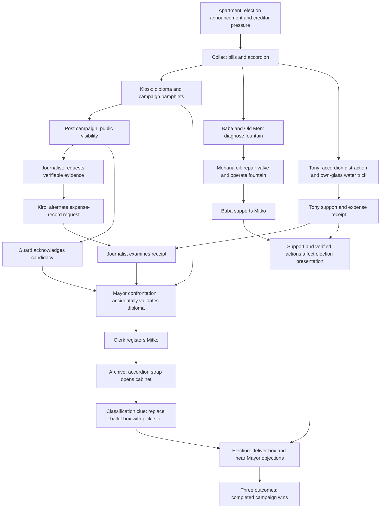

> **22 September checkpoint:** Election staging and all three outcome branches are implemented. Both supporters guarantee a win. See [current review and outcome contract](chapter1-review-220926.md), which supersedes earlier “next: election” notes and narrow-win rules below. Human visual/playtest review and dedicated Ludo.ai action exports remain.

# Chapter 1 completion plan — 16 September 2026

The user approved the completion recommendations recorded in
`../FurtherSteps160926.txt`. This document reconciles the target scenario; it is
not a claim that every target beat is implemented. The gameplay-flow contract
continues to document playable behavior. Script v1 remains the narrative source,
with the decisions below superseding its contradictory outcome and role rules.

## Scenario decisions

- Mitko runs for Mayor. Registration and voting happen on the same fictional day;
  creditor pressure is narrative, never a real-time countdown.
- Restore the public-repair, expense-receipt, accidental-validation and
  transparent-container connections from script v1. Preserve existing IDs.
- Retain convincing win, narrow win and loss. A fully completed campaign with
  both supporters must win; meters may reduce its margin, not invalidate it.
  An incomplete campaign can reach the finale and lose, with a clear explanation.
  Therefore the receipt investigation must be accessible without winning Tony's
  support: Tony supplies it after his challenge, while Kiro supplies the same
  public-expense record on request once the journalist asks for evidence. Neither
  route creates duplicate evidence. Exact outcome balancing is a later task.
- Preserve Clerk Penka's existing identity and `npc.municipality_clerk`. The kiosk
  operator is the script's Penka Docheva, consistently addressed as Aunt Docheva /
  леля Дочева to distinguish her from the clerk. She speaks through the existing
  kiosk hotspot until separate character art/staging is reviewed; no duplicate
  overlapping NPC hotspot is required for this first implementation.
- No renderer, animation-pipeline, resolution or approved-art replacement is part
  of this work. Final art follows staged story review.

## Target dependency map

Support arrows affect the result, not access to the election. The journalist's
investigation and the later interview can share the existing quest/NPC IDs with
separate stages. The user subsequently requested a separate Mayor office, entered
through a labelled door replacing the municipality's leftmost service bay. That
room and its return exit now exist for art/staging review; confrontation logic
remains planned. Archive staging remains in the municipality.

## Implementation order and acceptance

1. Opening/campaign foundation: TV or apartment-poster Look establishes premise;
   kiosk conversation and bills handover produce papers; pamphlets can be posted
   once. Existing prototype credentials remain accepted during the transition.
   Repeated actions, item drops and old saves must not duplicate rewards.
2. Baba/fountain: old-men clue, oil on valve, visible operational state, supporter
   reaction and persistent quest stages. Provide oil recovery if consumed; retain
   already-earned votes in older saves. Replace fresh-game gift-vote logic only
   with the complete, tested repair route.
3. Receipt/registration: Tony reward and Kiro fallback, early journalist presence,
   campaign-recognition gate, Mayor confrontation and clerk registration. Replace
   self-service stamping only when the whole replacement chain is playable.
4. Archive/finale: accordion strap, classification, jar exchange, Mayor objections,
   crowd reactions and creditor callback. Replace cellar recovery atomically;
   recognize already recovered/delivered boxes and resolved older endings.
5. Player clarity and QA: staged objectives, wrong-item clues, stronger hints;
   ordinary-click playthroughs in BG/EN; save/reload at every milestone; all outcome
   paths, route orders and first-time-player feedback.
6. Presentation: required missing art and action animations first, then audio,
   inventory icons, UI and optional restyling. Human art/playtest review remains
   an explicit production milestone, not an automated-test claim.

## First implementation pass

Implemented: opening Look sequence/recap, kiosk dialogue and paper handover,
legacy-diploma pamphlet pickup, poster action and state-aware Look feedback,
main-quest guidance for opening and campaign preparation, bilingual text.
Inventory items awaiting art now show their localized names instead of empty
buttons. Regression coverage includes a normal-mouse-input opening/kiosk/posting
route in both languages, using read-only state observations for assertions.

Transitional: bills + envelope still works; fake-diploma quest still completes
when credentials are made; campaign posting does not yet gate municipal entry or
spawn the journalist. Self-service stamp, cellar and result-panel
routes remain until their replacements are ready. A weathered notice covers the kiosk portrait until `campaignPosted` is set;
posting reveals the existing portrait and persists across reloads.

## Fountain implementation pass

Step 2 is implemented. Baba asks for a working public fountain. Inspection and the
Old Men identify the jammed valve; oil from the mehana lubricates it, and Use turns
it on. Animated water confirms the repair; reporting back awards support once.
Gift offers now explain her request without consuming items or damaging trust.
Kiro replaces consumed oil only when no bottle is carried or dropped anywhere.
Quest stages and stronger retry hints support either discovery order. Legacy votes
remain earned, and completed losing endings keep their expired support quests.
Real-click coverage includes consuming oil, requesting a replacement, repair and
mid-puzzle reloads; focused tests cover dropped oil and legacy states.

Still to implement: steps 3–6 above, automatic/staged opening presentation if
needed after playtesting, and any further opening/campaign presentation identified in playtests.
The earlier 12-panel storyboard is archived as a prototype reference. The local
storyboard menu now displays `chapter-one-visual-storyboard.pdf`: the supplied
treatment revised to 17 pages with three outcomes, optional supporter routes,
Kiro's receipt fallback and conditional ending staging. It describes planned
behavior, not completed runtime coverage. `../FurtherSteps160926.txt` contains
the updated ordered implementation checklist and milestone acceptance criteria.

## Save and content contracts

Use optional flags for additive story progress. Old saves without them continue
to work; a resolved ending must never reopen. Do not rename/remove existing scene,
item, quest, hotspot or animation IDs. Each replacement milestone needs tests for
its legacy-save path before activation. Do not infer possession solely from a
historical acquisition flag: unique dropped items must remain recoverable.

## Registration replacement — implemented

Steps 3 / action-plan steps 2–3 are complete: posting reveals the journalist and
opens municipal entry; Tony or Kiro supplies unique evidence; receipt handover
moves the reporter into the office. Clerk inspection, the witnessed Mayor
confrontation and accidental validation, then clerk registration form the new
chain. The diploma quest completes at registration. The seal is a prop rather
than a collectible shortcut. Reporter presence and all milestones survive reload.

Legacy registered saves remain valid. Incomplete old saves that completed the
diploma quest on paper creation regain the unfinished quest; completed endings
remain closed. Final interview and cellar recovery remain until the archive
replacement. The stamping action is dialogue-staged; its dedicated animation
and missing receipt/diploma icons are still presentation work.

Validation: 227 full-suite tests passed, plus 37 focused tests after adding the
door-gate regression. The normal-click BG/EN route runs from the apartment through
registration, including handover/validation reloads. Next: archive/jar exchange.

## Implemented checkpoint: archive exchange

Storyboard pages 10–11 now run as a cabinet-drawer close-up in the municipality.
Registration → inspect handle → accordion strap → ledger → jar replacement →
empty box. Clerk dialogue, journal stages and the journalist’s later question
match the archive route in both languages. Existing recovered-box saves remain
valid; the mehana cellar no longer awards the box. Four painted assets and two
inventory icons are integrated. Dedicated pulling/swapping animations remain
presentation work. Next: Step 5, election staging and outcome branches.

Validation: 234 tests passed. Normal-input BG/EN journeys include the entire
registration and archive sequence, with reloads after opening and jar placement.
